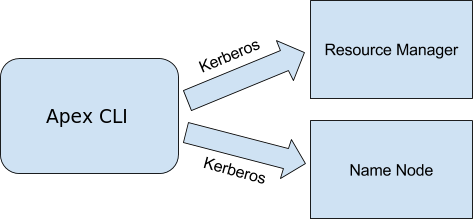
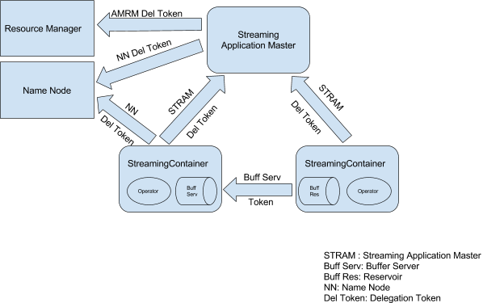

Security
==========

Applications built on Apex run as native YARN applications on Hadoop. The security framework and apparatus in Hadoop apply to the applications. The default security mechanism in Hadoop is Kerberos.

Kerberos Authentication
-----------------------

Kerberos is a ticket based authentication system that provides authentication in a distributed environment where authentication is needed between multiple users, hosts and services. It is the de-facto authentication mechanism supported in Hadoop. To use Kerberos authentication, the Hadoop installation must first be configured for secure mode with Kerberos. Please refer to the administration guide of your Hadoop distribution on how to do that. Once Hadoop is configured, there is some configuration needed on Apex side as well.

Configuring security
---------------------

There is Hadoop configuration and CLI configuration. Hadoop configuration may be optional.

###Hadoop Configuration

An Apex application uses delegation tokens to authenticate with the ResourceManager (YARN) and NameNode (HDFS) and these tokens are issued by those servers respectively. Since the application is long-running,
the tokens should be valid for the lifetime of the application. Hadoop has a configuration setting for the maximum lifetime of the tokens and they should be set to cover the lifetime of the application. There are separate settings for ResourceManager and NameNode delegation
tokens.

The ResourceManager delegation token max lifetime is specified in `yarn-site.xml` and can be specified as follows for example for a lifetime of 1 year

```xml
<property>
  <name>yarn.resourcemanager.delegation.token.max-lifetime</name>
  <value>31536000000</value>
</property>
```

The NameNode delegation token max lifetime is specified in
hdfs-site.xml and can be specified as follows for example for a lifetime of 1 year

```xml
<property>
   <name>dfs.namenode.delegation.token.max-lifetime</name>
   <value>31536000000</value>
 </property>
```

###CLI Configuration

The Apex command line interface is used to launch
applications along with performing various other operations and administrative tasks on the applications.  When Kerberos security is enabled in Hadoop, a Kerberos ticket granting ticket (TGT) or the Kerberos credentials of the user are needed by the CLI program `dtcli` to authenticate with Hadoop for any operation. Kerberos credentials are composed of a principal and either a _keytab_ or a password. For security and operational reasons only keytabs are supported in Hadoop and by extension in Apex platform. When user credentials are specified, all operations including launching
application are performed as that user.

#### Using kinit

A Kerberos ticket granting ticket (TGT) can be obtained by using the Kerberos command `kinit`. Detailed documentation for the command can be found online or in man pages. An sample usage of this command is

    kinit -k -t path-tokeytab-file kerberos-principal

If this command is successful, the TGT is obtained, cached and available for other programs. The CLI program `dtcli` can then be started to launch applications and perform other operations.

#### Using Kerberos credentials

The CLI program `dtcli` can also use the Kerberos credentials directly without requiring a TGT to be obtained separately. This can be useful in batch mode where `dtcli` is not launched manually and also in scenarios where running another program like `kinit` is not feasible.

The credentials can be specified in the `dt-site.xml` configuration file. If only a single user is launching applications, the global `dt-site.xml` configuration file in the installation folder can be used. In a multi-user environment the users can use the `dt-site.xml` file in their
home directory. The location of this file will be `$HOME/.dt/dt-site.xml`. If this file does not exist, the user can create a new one.

The snippet below shows the how the credentials can be specified in the configuration file as properties.

```xml
<property>
        <name>dt.authentication.principal</name>
        <value>kerberos-principal-of-user</value>
</property>
<property>
        <name>dt.authentication.keytab</name>
        <value>absolute-path-to-keytab-file</value>
</property>
```

The property `dt.authentication.principal` specifies the Kerberos user principal and `dt.authentication.keytab` specifies the absolute path to the keytab file for the user.

The subsequent sections talk about how security works in Apex. This information is not needed by users but is intended for the inquisitive techical audience who want to know how security works.

Security architecture
----------------------

In this section we will see how security works for applications built on Apex. We will look at the different methodologies involved in running the applications and in each case we will look into the different components that are involved. We will go into the architecture of these components and look at the different security mechanisms that are in play.

###Application Launch

To launch applications in Apache Apex the command line client dtcli can be used. The application artifacts such as binaries and properties are supplied as an application package. The client, during the various steps involved to launch the application needs to communicate with both the Resource Manager and the Name Node. The Resource Manager communication involves the client asking for new resources to run the application master and start the application launch process. The steps along with sample Java code are described in Writing YARN Applications. The Name Node communication includes the application artifacts being copied to HDFS so that they are available across the cluster for launching the different application containers.

In secure mode, the communications with both Resource Manager and Name Node requires authentication and the mechanism is Kerberos. Below is an illustration showing this.

		


The client dtcli supports Kerberos authentication and will automatically enable it in a secure environment. To authenticate, some Kerberos configuration namely the Kerberos credentials, are needed by the client. There are two parameters, the Kerberos principal and keytab to use for the client. These can be specified in the dt-site.xml configuration file. The properties are shown below

        <property>
                <name>dt.authentication.principal</name>
                <value>kerberos-principal-of-user</value>
        </property>
        <property>
                <name>dt.authentication.keytab</name>
                <value>absolute-path-to-keytab-file</value>
        </property>

Refer to document Operation and Installation Guide section Multi Tenancy and Security subsection CLI Configuration in the documentation for more information. The document can also be accessed here client configuration

There is another important functionality that is performed by the client and that is to retrieve what are called delegation tokens from the Resource Manager and Name Node to seed the application master container that is to be launched. This is detailed in the next section. 

###Runtime Security

When the application is completely up and running, there are different components of the application running as separate processes possibly on different nodes in the cluster as it is a distributed application. These components interactwould be interacting with each other and the Hadoop services. In secure mode, all these interactions have to be authenticated before they can be successfully processed. The interactions are illustrated below in a diagram to give a complete overview. Each of them is explained in subsequent sections.




####STRAM and Hadoop

Every Apache Apex application has a master process akin to any YARN application. In our case it is called STRAM (Streaming Application Master). It is a master process that runs in its own container and manages the different distributed components of the application. Among other tasks it requests Resource Manager for new resources as they are needed and gives back resources that are no longer needed. STRAM also needs to communicate with Name Node from time-to-time to access the persistent HDFS file system. 

In secure mode, STRAM has to authenticate with both Resource Manager and Name Node before it can send any requests and this is achieved using Delegation Tokens. Since STRAM runs as a managed application master, it runs in a Hadoop container. This container could have been allocated on any node based on what resources were available. Since there is no fixed node where STRAM runs, it does not have Kerberos credentials. Unlike launch client dtcli, it cannot authenticate with Hadoop services Resource Manager and Name Node using Kerberos. Instead, Delegation Tokens are used for authentication.

#####Delegation Tokens

Delegation tokens are tokens that are dynamically issued by the source and clients use them to authenticate with the source. The source stores the delegation tokens it has issued in a cache and checks the delegation token sent by a client against the cache. If a match is found, the authentication is successful else it fails. This is the second mode of authentication in secure Hadoop after Kerberos. More details can be found in the Hadoop security design document. In this case the delegation tokens are issued by Resource Manager and Name Node. STRAM would use these tokens to authenticate with them. But how does it get them in the first place? This is where the launch client dtcli comes in.

The client dtcli, since it possesses Kerberos credentials as explained in the Application Launch section, is able to authenticate with Resource Manager and Name Node using Kerberos. It then requests for delegation tokens over the Kerberos authenticated connection. The servers return the delegation tokens in the response payload. The client in requesting the resource manager for the start of the application master container for STRAM seeds it with these tokens so that when STRAM starts it has these tokens. It can then use these tokens to authenticate with the Hadoop services.

####Streaming Container

A streaming container is a process that runs a part of the application business logic. It is a container deployed on a node in the cluster. The part of business logic is implemented in what we call an operator. Multiple operators connected together make up the complete application and hence there are multiple streaming containers in an application. The streaming containers have different types of communications going on as illustrated in the diagram above. They are described below.

#####STRAM Delegation Token

The streaming containers periodically communicate with the application master STRAM. In the communication they send what are called heartbeats with information such as statistics and receive commands from STRAM such as deployment or un-deployment of operators, changing properties of operators etc. In secure mode, this communication cannot just occur without any authentication. To facilitate this authentication special tokens called STRAM Delegation Tokens are used. These tokens are created and managed by STRAM. When a new streaming container is being started, since STRAM is the one negotiating resources from Resource Manager for the container and requesting to start the container, it seeds the container with the STRAM delegation token necessary to communicate with it. Thus, a streaming container has the STRAM delegation token to successfully authenticate and communicate with STRAM.

#####Buffer Server Token

As mentioned earlier an operator implements a piece of the business logic of the application and multiple operators together complete the application. In creating the application the operators are assembled together in a direct acyclic graph, a pipeline, with output of operators becoming the input for other operators. At runtime the stream containers hosting the operators are connected to each other and sending data to each other. In secure mode these connections should be authenticated too, more importantly than others, as they are involved in transferring application data.

When operators are running there will be effective processing rate differences between them due to intrinsic reasons such as operator logic or external reasons such as different resource availability of CPU, memory, network bandwidth etc. as the operators are running in different containers. To maximize performance and utilization the data flow is handled asynchronous to the regular operator function and a buffer is used to intermediately store the data that is being produced by the operator. This buffered data is served by a buffer server over the network connection to the downstream streaming container containing the operator that is supposed to receive the data from this operator. This connection is secured by a token called the buffer server token. These tokens are also generated and seeded by STRAM when the streaming containers are deployed and started and it uses different tokens for different buffer servers to have better security.

#####NameNode Delegation Token

Like STRAM, streaming containers also need to communicate with NameNode to use HDFS persistence for reasons such as saving the state of the operators. In secure mode they also use NameNode delegation tokens for authentication. These tokens are also seeded by STRAM for the streaming containers.

Conclusion
-----------

We looked at the different security requirements for distributed applications when they run in a secure Hadoop environment and looked at how Apex solves this.
